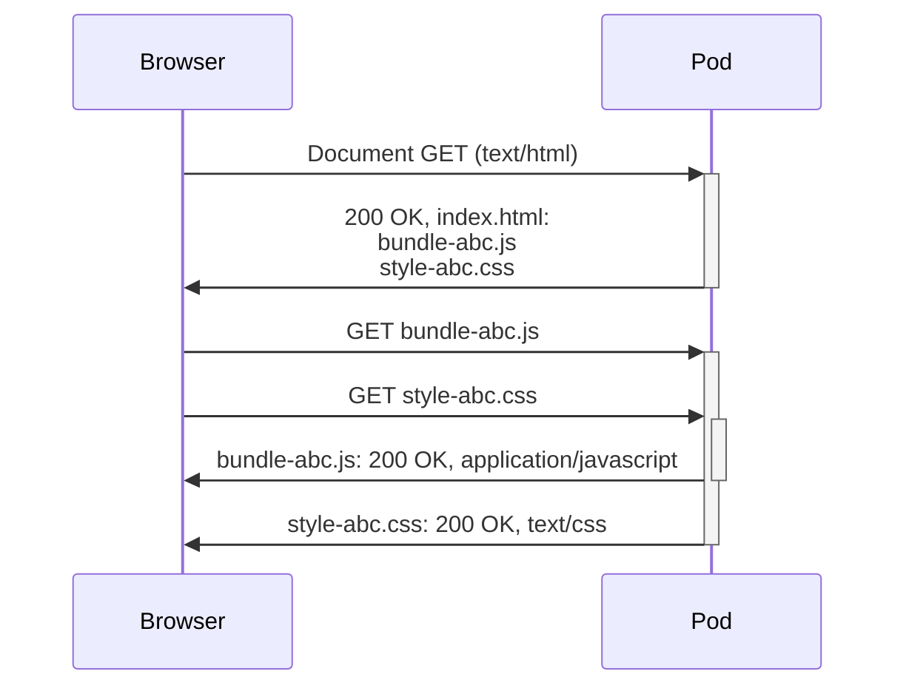
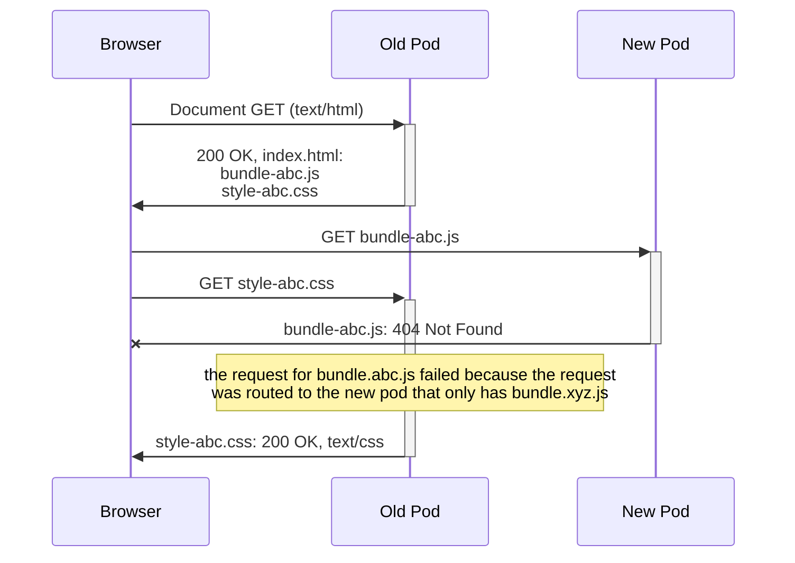
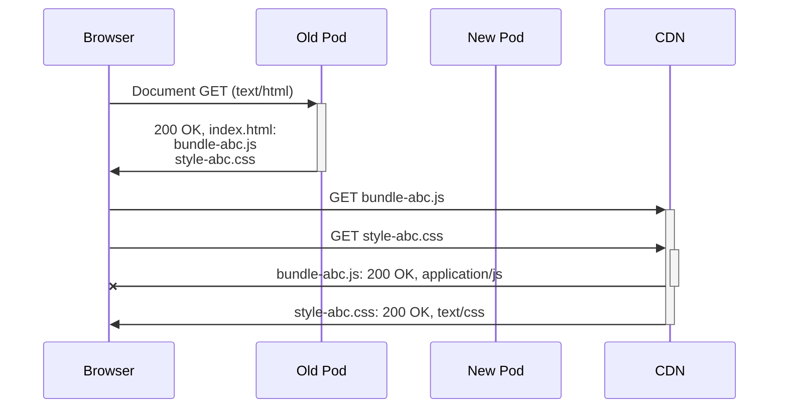

# Problemer med flere pods og statiske filer

### Standard flyt med bare èn pod



### Flyt med ny og gammel pod

```plain
Gammel pod:
/bundle-abc.js
/style-abc.js

Ny pod:
/bundle-xyz.js
/style-xyz.js
```





### Happy path med CDN og ny og gammel pod

```plain
CDN:
/bundle-abc.js
/style-abc.js
/bundle-xyz.js
/style-xyz.js
```


